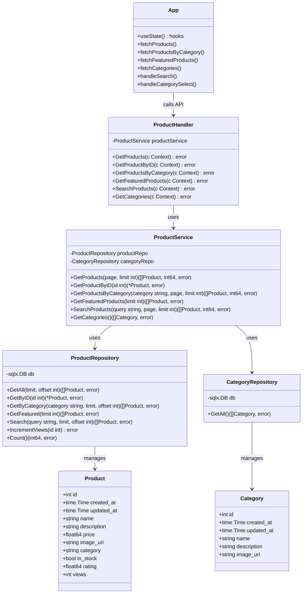

# Исследование архитектурного решения

## Часть 1. Проектирование архитектуры (To Be)

### 1. Тип приложения

**Tenderness** - это веб-приложение электронной коммерции (e-commerce) для продажи товаров взрослого ассортимента со следующими характеристиками:

- **Тип:** Веб-приложение с разделением на клиентскую и серверную части
- **Архитектурный стиль:** Клиент-серверная архитектура с RESTful API
- **Паттерн:** Трёхслойная архитектура (Presentation → Business Logic → Data Access)
- **Масштабируемость:** Горизонтальная через контейнеризацию

### 2. Стратегия развёртывания

**Контейнеризация с Docker и Docker Compose:**

```
┌─────────────────┐    ┌─────────────────┐    ┌─────────────────┐
│   React Client  │    │   Go API Server │    │  PostgreSQL DB  │
│   (Port 80)     │◄──►│   (Port 3000)   │◄──►│   (Port 5432)   │
│   Nginx Proxy   │    │   Fiber v3      │    │   SQL Database  │
└─────────────────┘    └─────────────────┘    └─────────────────┘
       ▲                       ▲                       ▲
       │                       │                       │
       └───────────────────────┼───────────────────────┘
                               │
                    ┌─────────────────┐
                    │ Docker Network  │
                    │ tenderness-net  │
                    └─────────────────┘
```

**Преимущества стратегии:**
- Изоляция компонентов
- Простота масштабирования
- Единообразие окружений
- Автоматизация развёртывания

### 3. Обоснование выбора технологии

#### Backend: Go 1.25 + Fiber v3
- **Производительность:** Высокая скорость обработки запросов
- **Concurrency:** Встроенная поддержка горутин для параллельной обработки
- **Минимализм:** Компилируемый язык с быстрым стартом
- **Экосистема:** Богатая стандартная библиотека и сторонние пакеты

#### Frontend: React 18 + Vite
- **Компонентный подход:** Переиспользуемые UI компоненты
- **Виртуальный DOM:** Оптимизация рендеринга
- **Экосистема:** Огромное сообщество и библиотеки
- **Vite:** Быстрая разработка и сборка

#### Database: PostgreSQL 17.4
- **ACID транзакции:** Гарантия целостности данных
- **JSON поддержка:** Гибкость хранения структурированных данных
- **Масштабируемость:** Вертикальная и горизонтальная
- **Надёжность:** Проверенная временем СУБД

### 4. Показатели качества

| Показатель | Целевое значение | Метрика измерения |
|------------|------------------|-------------------|
| **Производительность** | < 100ms response time | Время ответа API |
| **Доступность** | 99.9% uptime | Uptime мониторинг |
| **Пропускная способность** | 1000 RPS | Requests per second |
| **Использование памяти** | < 512MB (backend) | RAM consumption |
| **Время загрузки** | < 2s (first paint) | Page load time |
| **Безопасность** | A+ grade | Security headers scan |

### 5. Сквозная функциональность

#### Аутентификация и авторизация
```
Client → JWT Token → API Middleware → Service Layer → Database
```

#### Логирование и мониторинг
```
Application → Structured Logging → ELK Stack (в будущем)
```

#### Обработка ошибок
```
Global Error Handler → Standardized Error Response → Client Error Boundary
```

#### Кэширование
```
Redis Layer (в будущем) → API Response Cache → Client Cache
```

### 6. Структурная схема приложения

#### Функциональные блоки и слои:

```
┌─────────────────────────────────────────────────────────────┐
│                    PRESENTATION LAYER                       │
├─────────────────────────────────────────────────────────────┤
│  React Components (Client)                                  │
│  ┌─────────────┐ ┌─────────────┐ ┌─────────────┐            │
│  │   Header    │ │ ProductGrid │ │  SearchBar  │            │
│  └─────────────┘ └─────────────┘ └─────────────┘            │
│           │               │               │                 │
│           └───────────────┼───────────────┘                 │
│                           │                                 │
├─────────────────────────────────────────────────────────────┤
│                    API GATEWAY LAYER                        │
├─────────────────────────────────────────────────────────────┤
│  Fiber Router (Server)                                      │
│  ┌─────────────┐ ┌─────────────┐ ┌─────────────┐            │
│  │   /health   │ │ /api/prods  │ │ /api/cats   │            │
│  └─────────────┘ └─────────────┘ └─────────────┘            │
│                           │                                 │
├─────────────────────────────────────────────────────────────┤
│                   BUSINESS LOGIC LAYER                      │
├─────────────────────────────────────────────────────────────┤
│  Services                                                   │
│  ┌────────────────┐    ┌─────────────────┐                  │
│  │ ProductService |    │ CategoryService │                  │
│  └────────────────┘    └─────────────────┘                  │
│           │               │                                 │
│           └───────────────┼───────────────┘                 │
│                           │                                 │
├─────────────────────────────────────────────────────────────┤
|                    DATA ACCESS LAYER                        │
├─────────────────────────────────────────────────────────────┤
│  Repositories                                               │
│  ┌─────────────┐ ┌─────────────┐                            │
│  │ProductRepo  │ │CategoryRepo │                            │
│  └─────────────┘ └─────────────┘                            │
│                           │                                 │
├─────────────────────────────────────────────────────────────┤
|                    DATA STORAGE LAYER                       │
├─────────────────────────────────────────────────────────────┤
│  PostgreSQL Database                                        │
│  ┌─────────────┐ ┌─────────────┐                            │
│  │  products   │ │ categories  │                            │
│  └─────────────┘ └─────────────┘                            │
└─────────────────────────────────────────────────────────────┘
```

#### Связи между компонентами:

1. **Vertical Flow:** Client → API → Service → Repository → Database
2. **Horizontal Flow:** Service ↔ Service (для бизнес-логики)
3. **Data Flow:** Unidirectional (top-down)
4. **Dependency Injection:** Через конструкторы

---

## Часть 2. Анализ архитектуры (As Is)

### Анализ существующего кода

На основе анализа реального кода проекта была сгенерирована диаграмма классов, отражающая фактическую архитектуру системы.

### Диаграмма классов (As Is)



### Структура пакетов Go:

```
server/
├── cmd/
│   └── tenderness/
│       └── main.go              # Точка входа
├── internal/
│   ├── app/
│   │   └── app.go              # Инициализация приложения
│   ├── configs/
│   │   └── config.go           # Конфигурация
│   ├── domain/
│   │   ├── models/
│   │   │   └── product.go      # Модели данных
│   │   └── storage/
│   │       └── interfaces.go   # Интерфейсы хранилищ
│   ├── handlers/
│   │   ├── product_handler.go  # HTTP обработчики
│   │   └── health.go
│   ├── repository/
│   │   ├── product_repository.go
│   │   └── category_repository.go
│   ├── routes/
│   │   └── routes.go           # Маршрутизация
│   └── services/
│       └── product_service.go  # Бизнес-логика
└── migrations/                 # Миграции БД
```

---

## Часть 3. Сравнение и рефакторинг

### 1. Сравнение архитектур "As Is" и "To Be"

#### Соответствия запланированной архитектуре:

✅ **Трёхслойная архитектура:** Реализована корректно
- Presentation Layer: React компоненты
- Business Logic Layer: Services
- Data Access Layer: Repositories

✅ **Разделение ответственности:** Чёткое разделение на слои
- Handlers обрабатывают HTTP запросы
- Services содержат бизнес-логику
- Repositories работают с базой данных

✅ **Dependency Injection:** Используется через конструкторы

#### Расхождения с запланированной архитектурой:

❌ **Отсутствие валидации:** Нет валидации входных данных
❌ **Отсутствие кэширования:** Каждый запрос идёт в БД
❌ **Простая обработка ошибок:** Нет централизованной обработки ошибок
❌ **Отсутствие конфигурации:** Нет управления конфигурацией окружения

### 2. Анализ отличий и их причин

#### Причины отклонений:

1. **Этап разработки:** Проект находится на раннем этапе (MVP)
2. **Простота:** Приоритет отдан быстрой разработке над архитектурной сложностью
3. **Отсутствие требований:** Нет требований к безопасности и производительности
4. **Итеративный подход:** Функциональность добавляется постепенно

#### Влияние на качество системы:

- **Производительность:** Отсутствие кэширования увеличивает нагрузку на БД
- **Безопасность:** Отсутствие аутентификации создаёт риски
- **Надёжность:** Простая обработка ошибок может привести к сбоям
- **Масштабируемость:** Отсутствие middleware усложняет добавление функциональности

### 3. Пути улучшения архитектуры

#### Немедленные улучшения:

1. **Добавить middleware layer:**
```go
// middleware/auth.go
func JWTAuth() fiber.Handler {
    return func(c *fiber.Ctx) error {
        // JWT валидация
    }
}

// middleware/logging.go
func RequestLogger() fiber.Handler {
    return func(c *fiber.Ctx) error {
        // Логирование запросов
    }
}
```

2. **Централизованная обработка ошибок:**
```go
// middleware/error.go
func ErrorHandler() fiber.Handler {
    return func(c *fiber.Ctx) error {
        // Стандартизация ошибок
    }
}
```

3. **Валидация входных данных:**
```go
// validator/product.go
func ValidateProductRequest(p *ProductRequest) error {
    // Валидация полей
}
```

#### Среднесрочные улучшения:

1. **Добавить кэширование:**
```go
// cache/redis.go
type Cache interface {
    Get(key string) (string, error)
    Set(key string, value string, ttl time.Duration) error
}
```

2. **Улучшить конфигурацию:**
```go
// config/config.go
type Config struct {
    Database DatabaseConfig
    Server   ServerConfig
    Cache    CacheConfig
}
```

3. **Добавить мониторинг:**
```go
// metrics/prometheus.go
func RegisterMetrics() {
    // Метрики производительности
}
```

#### Долгосрочные улучшения:

1. **Микросервисная архитектура:**
- Разделение на сервисы продуктов, пользователей, заказов
- Использование message broker (RabbitMQ/Kafka)

2. **CQRS паттерн:**
- Разделение операций чтения и записи
- Оптимизация производительности

3. **Event-driven архитектура:**
- Событийная интеграция между сервисами
- Асинхронная обработка

### Рекомендации по рефакторингу:

1. **Приоритет 1 (Критично):** Добавить middleware для аутентификации и логирования
2. **Приоритет 2 (Важно):** Реализовать кэширование и валидацию
3. **Приоритет 3 (Желательно):** Улучшить обработку ошибок и конфигурацию
4. **Приоритет 4 (Будущее):** Рассмотреть микросервисную архитектуру при росте нагрузки

---

## Выводы

В ходе лабораторной работы была проанализирована архитектура веб-приложения "Tenderness". Запланированная архитектура (To Be) соответствует современным практикам с трёхслойной структурой и контейнеризацией. Фактическая архитектура (As Is) реализует базовые принципы, но требует доработок в области безопасности, производительности и надёжности.

Основные различия связаны с этапом разработки проекта - текущая реализация представляет собой MVP с минимальным функционалом. Для перехода к production-ready состоянию рекомендуется реализовать предложенные улучшения в порядке приоритета.

Архитектурная основа проекта является хорошей базой для дальнейшего развития и масштабирования.
